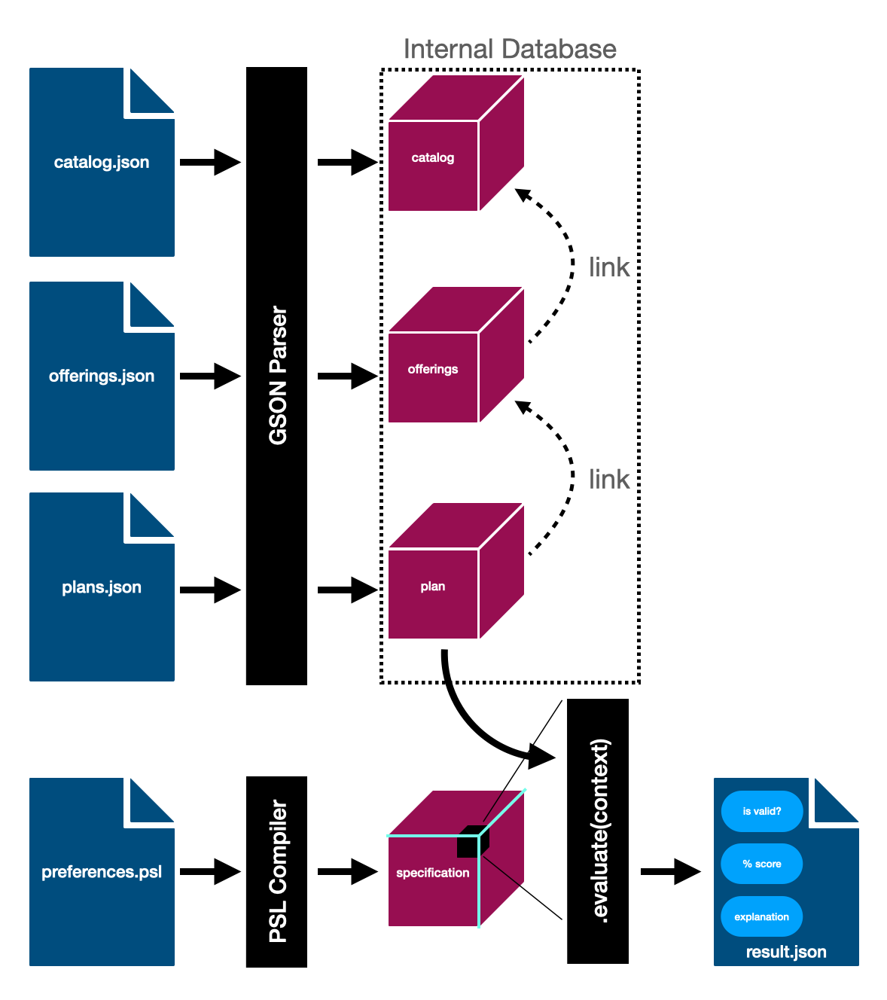

# PSL: An Expert System to Evaluate Degree Plans

*Developed by Robert Swanson for Research I&II and for Envisage Planner*

## Links

- [GitHub Source](https://github.com/robert-swanson/Four-Year-Plan-Evaluation-System)
- [Literature Survey on College Course Scheduling Algorithms](../documents/Literature-Survey.pdf)
- [PSL Paper](../documents/Paper.pdf)
- [PSL Presentation](../documents/Presentation.pdf)
- [PSL Poster](../documents/Poster.pdf)
- [The PSL Prototype](https://github.com/robert-swanson/Preference-Specification-Language-Prototype)
- [Paper on the Prototype](../documents/Spring-Archive-Paper.pdf)

## Summary

PSL implements a system that can evaluate a college degree plan based on a highly personalized set of requirements and preferences.

The system is composed of two primary components:

1. The PSL grammar, which allows for highly expressive textual representation of requirements and preferences
2. The evaluation engine, which defines a library to create a specification object, which can evaluate degree plans

The evaluation engine also makes reference to an internal database of course information which are input to the system as json files. A degree plan json file specifies the plans that the system will pass into the evaluation engine.

## Topics

- [Development Environment Setup](./Developement-Environment-Setup)

- [PSL Grammar](PSL-Grammar.md)
- [Evaluation Engine](Evaluation-Engine.md)

